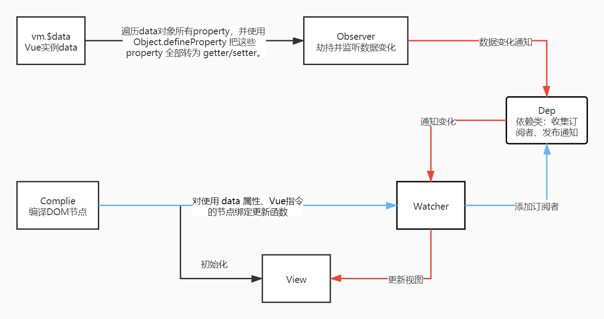

# MiniVue

使用 TypeScript 写一个 Vue2.x mini版本

## 如何运行 ?

npm install

npm run serve


## Observer 类

### 职责
劫持data，监听变化。

### 实现
遍历Vue实例data所有 `property` ，并且转换成 `getter` 和 `setter` ，在 `getter` 中收集依赖，在 `setter` 中发送通知。

```javascript
Object.defineProperty(obj, key, {
    enumerable: true,
    configurable: true,
    get() {
        Dep.target && dep.add(Dep.target);
        return val;
    },
    set(newVal) {
        if (val === newVal || Helper.isNaN(val, newVal)) {
            return;
        }
        val = newVal;
        self.walk(val);
        dep.notify();
    },
});
```


## Dep 依赖类

### 职责
统一管理单个数据的所有依赖。协助 `Observer` 收集订阅、发布通知。

### 实现

分为收集订阅和发布通知两个方法。

```javasc
/**
 * 收集订阅
 */
public add(dep: Watcher): void {
    if (dep && dep['update']) {
        this.subs.add(dep);
    }
}

/**
 * 发布通知
 */
public notify(): void {
    this.subs.forEach((dep) => dep.update());
}
```


## Watcher类

### 职责

每个组件实例都对应一个 `watcher` 实例，它会在组件渲染的过程中把“接触”过的数据 property 记录为依赖。之后当依赖项的 `setter` 触发时，会通知 `watcher`，从而使它关联的组件重新渲染。

## 实现

初始化时将 `watcher` 添加到依赖。

```javascript
constructor(private vm: MiniVue, private key: string, private cb: Method) {
    // 注册 watch 的时候，添加 target 标记。
    Dep.target = this;
    // vm[key] 取值触发 Observer getter ,将 this 添加到 dep.subs 中。
    this.__old = vm[key];
    Dep.target = null;
}
```

依赖数据变更时，`Dep` 调用 `update` ，使关联组件重新渲染。

```javascript
public update(): void {
    let newValue = this.vm[this.key];
    if (this.__old === newValue || Helper.isNaN(this.__old, newValue)) {
        return;
    }
    this.cb.applyWith(newValue);
    this.__old = newValue;
}
```


## Compiler 类

### 职责

编译根元素下的所有节点，并对 `v-model`、`v-on`、`v-text `等组件注册 `watcher` 实例。

### 实现

从根节点开始递归所有节点

```javascript
private compile(el: Node): void {
    Array.from(el.childNodes).forEach((node) => {
        if (this.isTextNode(node)) {
            this.compileText(node);
        } else if (this.isElementNode(node)) {
            this.compileElement(node as HTMLElement);
        }
        // 子节点还有子节点，递归遍历
        if (node.childNodes) {
            this.compile(node);
        }
    });
}
```

解析“Mustache”（双大括号）语法 

```javascript
private compileText(node: Node): void {
    const matchReg = /(?<=\{\{)(.+?)(?=\}\})/g, // 不包含 {{}}
        replaceReg = /\{\{(.+?)\}\}/g, // 包含 {{}}
        textContent = node.textContent || '';
    let matchArray = textContent.match(matchReg);
    if (matchArray && matchArray.length) {
        const updateText = (): void => {
            let i = 0;
            node.textContent = textContent.replace(replaceReg, () => {
                let key = matchArray![i++].trim();
                return this.vm[key];
            });
        };
        matchArray.forEach((match) => {
            let key = match.trim();
            new Watcher(
                this.vm,
                key,
                new Method((val: string) => {
                    updateText();
                }),
            );
        });
        updateText();
    }
}
```

解析 v- 和 @ 指令

```javascript
private compileElement(node: HTMLElement): void {
    if (node.attributes.length) {
        Array.from(node.attributes).forEach((attr) => {
            let attrName = attr.name;
            if (this.isDirective(attrName)) {
                // 以 ‘v-’开头 v-on:click || v-model / v-text
                attrName = attrName.indexOf(':') > -1 ? attrName.substr(5) : 								attrName.substr(2);
            } else if (attrName.startsWith('@')) {
                // 以 ‘@’ 开头 @click
                attrName = attrName.substr(1);
            } else {
                return;
            }
            let key = attr.value;
            this.update(node, key, attrName, this.vm[key]);
        });
    }
}
```

处理不同指令

```javascript
/**
 * 处理各种指令
 * @param node 指令对应节点
 * @param key 指令名称对应的值 v-attrName=key
 * @param attrName 指令名称
 * @param val data[key] || methods[key]
 */
private update(node: Node, key: string, attrName: string, val: any): void {
    if (attrName === 'text') {
        node.textContent = val;
        new Watcher(this.vm, key, new Method((val: string) => (node.textContent = val)));
    } else if (attrName === 'model') {
        const inputEle = node as HTMLInputElement;
        inputEle.value = val;
        new Watcher(this.vm, key, new Method((val: string) => (inputEle.value = val)));
        inputEle.addEventListener('input', () => {
            this.vm[key] = inputEle.value;
        });
    } else if (attrName === 'click') {
        node.addEventListener(attrName, this.methods[key].bind(this.vm));
    }
}
```


## MiniVue工作流程图



[mark](https://www.processon.com/diagraming/610e9d250791297a97e4bdf7)